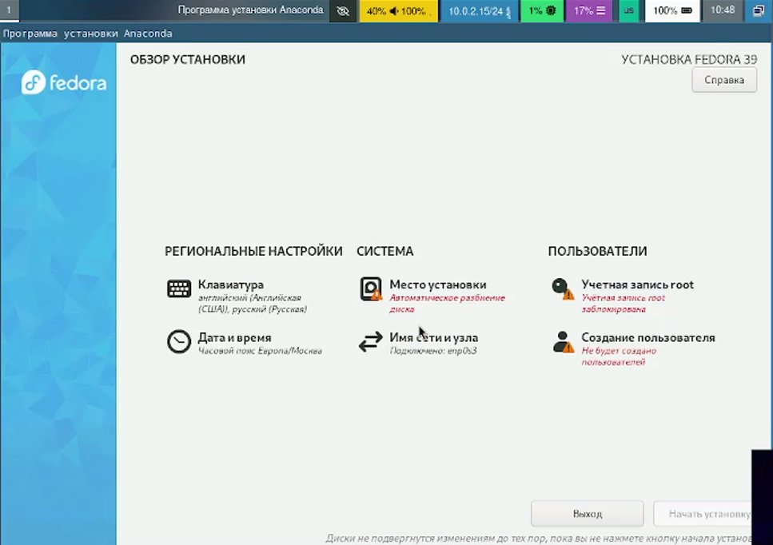
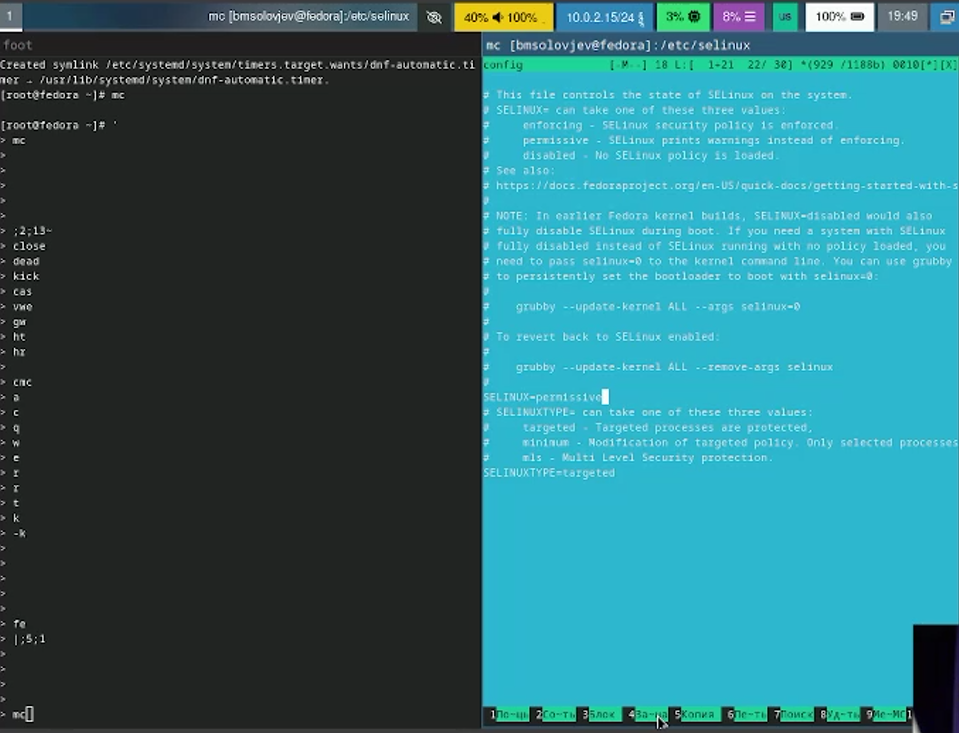
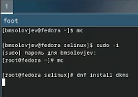
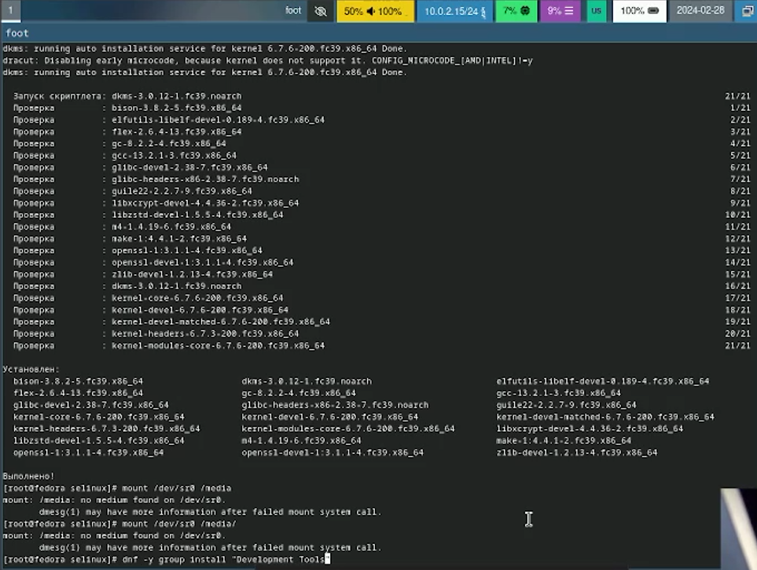
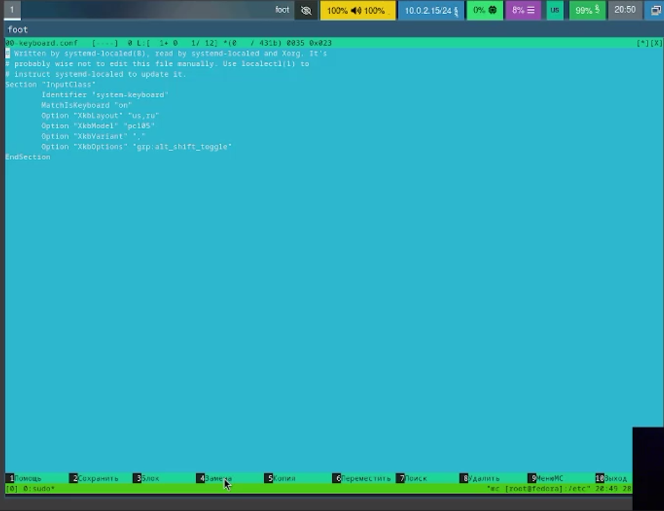
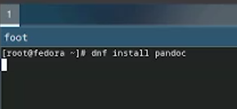
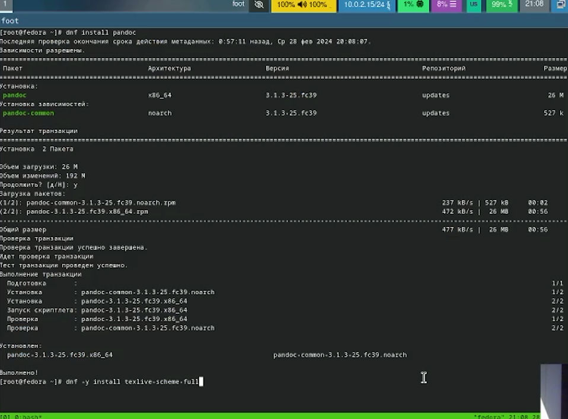
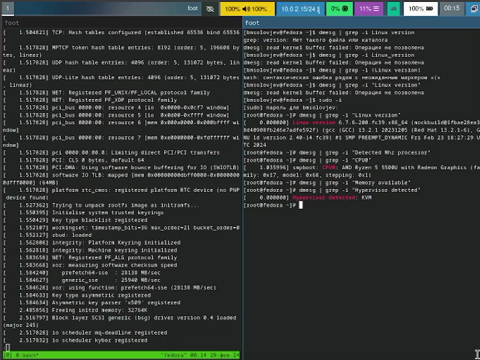

# Операционная система

---
## Установка операционной системы

---

## После установки

---

Отключаю SELinux. В файле /etc/selinux/config заменяю значение SELINUX=enforcing на SELINUX=permissive. А потом перезагружаю виртуальную машину.

---

## Установка драйверов для VirtualBox

---

Устанавливаю средства разработки "Development Tools"

---
# Настройка раскладки клавиатуры

Редактирую конфигурационный файл, заменив строчки, как указано в ходе лабораторной работы

---

# Установка ПО для презентаций
Устанавливаю pandoc

---

Устанавливаю TexLive

---

# Домашняя работа

Прописываю все комнады и узнаю информацию о системе (dmesg | less и dmesg | grep "инфорацию, которую хочу узнать")

---

# Вывод

При выполнении данно лабораторной работы я научился устанавливать ПО и настраивать операционную систему.

---

# Библиография

1. Dash, P. Getting Started with Oracle VM VirtualBox / P. Dash. – Packt Publishing Ltd, 2013. – 86 сс.
2. Colvin, H. VirtualBox: An Ultimate Guide Book on Virtualization with VirtualBox. VirtualBox / H. Colvin. – CreateSpace Independent Publishing Platform, 2015. – 70 сс.
3. Vugt, S. van. Red Hat RHCSA/RHCE 7 cert guide : Red Hat Enterprise Linux 7 (EX200 and EX300) : Certification Guide. Red Hat RHCSA/RHCE 7 cert guide / S. van Vugt. – Pearson IT Certification, 2016. – 1008 сс.
4. Робачевский, А. Операционная система UNIX / А. Робачевский, С. Немнюгин, О. Стесик. – 2-е изд. – Санкт-Петербург : БХВ-Петербург, 2010. – 656 сс.
---
5. Немет, Э. Unix и Linux: руководство системного администратора. Unix и Linux / Э. Немет, Г. Снайдер, Т.Р. Хейн, Б. Уэйли. – 4-е изд. – Вильямс, 2014. – 1312 сс.
6. Колисниченко, Д.Н. Самоучитель системного администратора Linux : Системный администратор / Д.Н. Колисниченко. – Санкт-Петербург : БХВ-Петербург, 2011. – 544 сс.
7. Robbins, A. Bash Pocket Reference / A. Robbins. – O’Reilly Media, 2016. – 156 сс.

