# Цель работы
Целью данной работы является приобретение практических навыков установки операционной системы на виртуальную машину, настройки минимально необходимых для дальнейшей работы сервисов.

---

# Операционная система

---
## Установка операционной системы
Я скачал образ fedora на основную машину, потом указал этот образ при создании виртуальной машины. Выполнил настройку и начал установку операционной системы. Далее выполнил настройку операционной системы, указав место установки, настроил учёитную запись и создал пользователя.

---

Установка прошла успешно
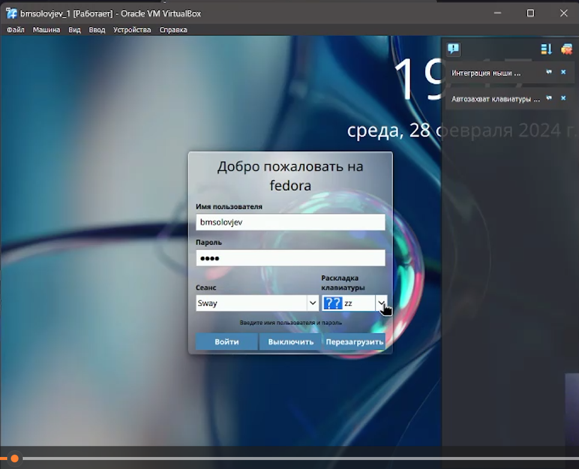

---
## После установки

Переключаюсь на роль супер-пользователя командой "sudo -i" и обновляю все пакеты "dnf -y update"

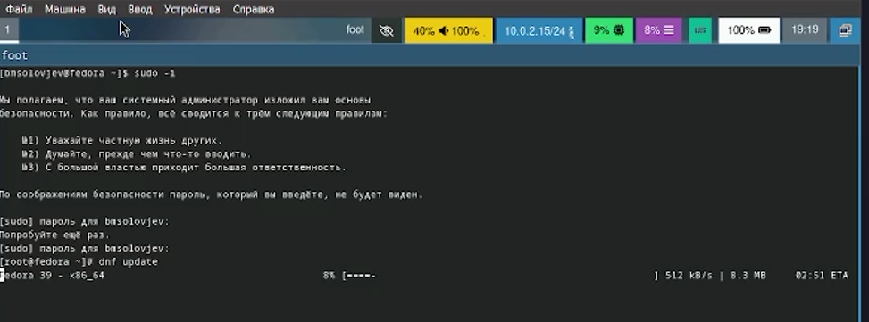

---

Прописываю команду "dnf -y install tmux mc"

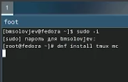

---

Подключаю автоматическое обновление

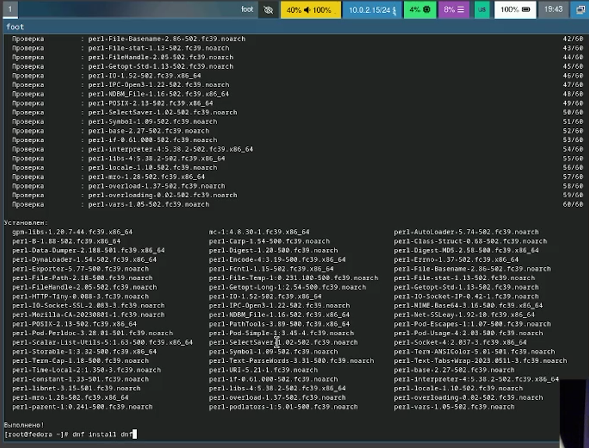

---

Отключаю SELinux. В файле /etc/selinux/config заменяю значение SELINUX=enforcing на SELINUX=permissive. А потом перезагружаю виртуальную машину.
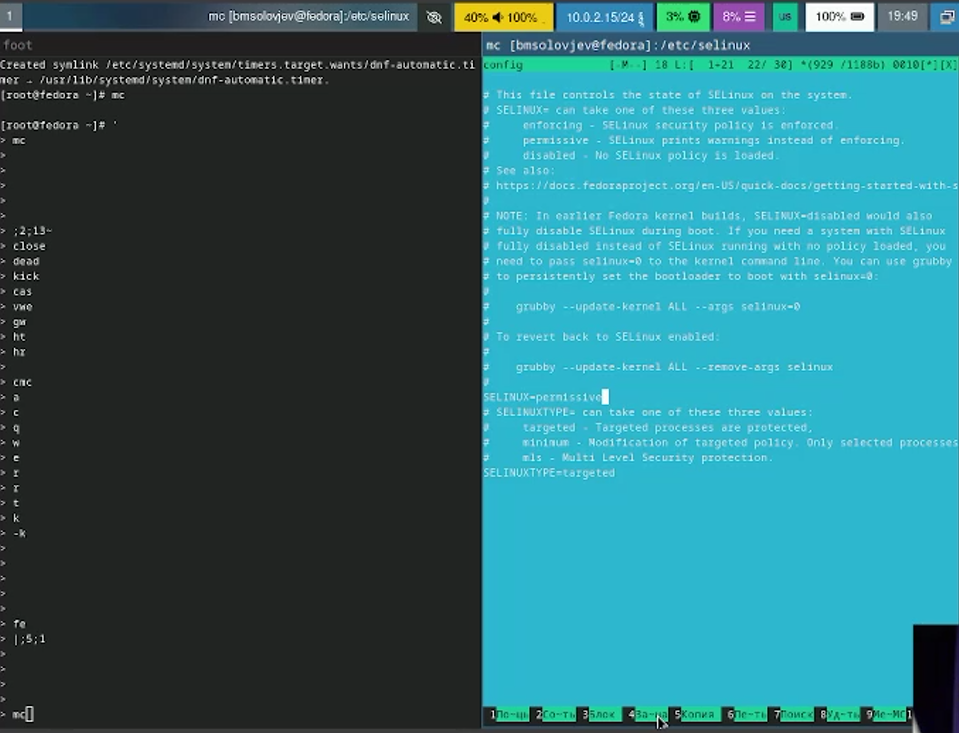

---

## Установка драйверов для VirtualBox

Снова прописываю "sudo -i" и устанавливаю пакет "dnf -y install dkms". Потом в меню ВМ подключаю оптический диск
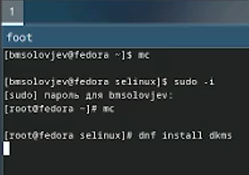

---

Устанавливаю средства разработки "Development Tools"

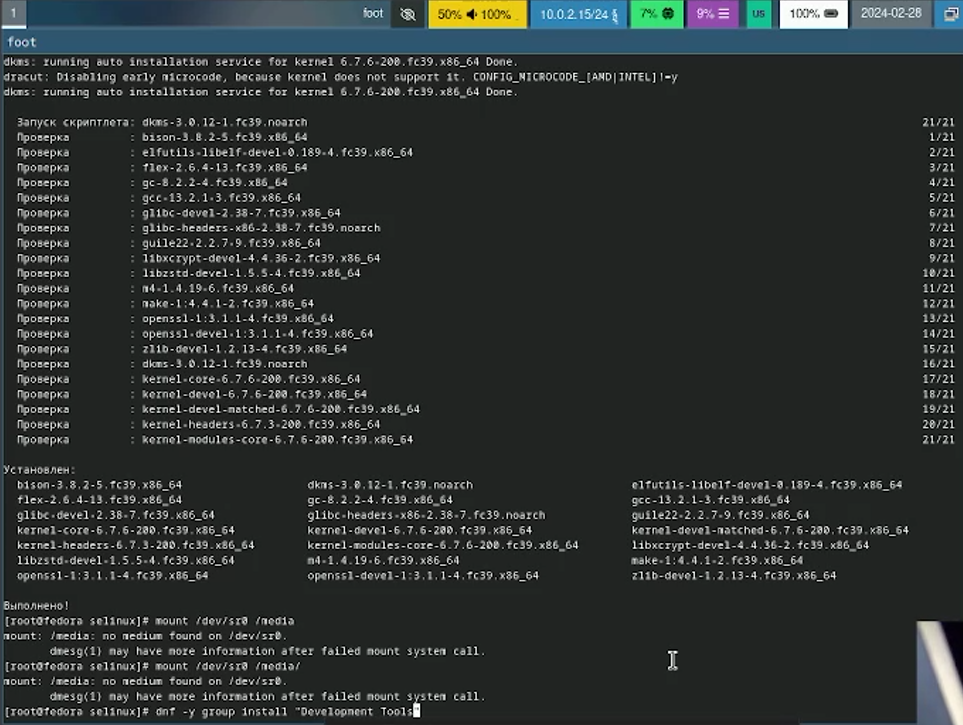

---

Подмонтирую диск "mount /dev/sr0 /media" и устанавливаю драйвера "/media/VBoxLinuxAdditions.run" и перезагружаю виртуальную машину
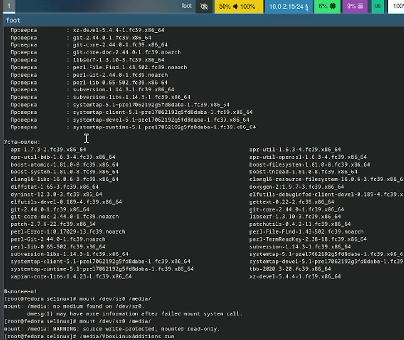

---
# Настройка раскладки клавиатуры

Редактирую конфигурационный файл, заменив строчки, как указано в ходе лабораторной работы
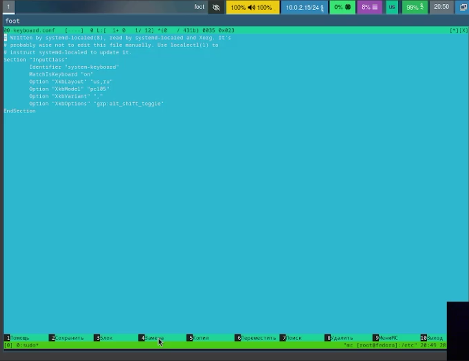

---

# Установка ПО для презентаций
Устанавливаю pandoc
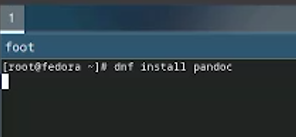

---

Устанавливаю TexLive
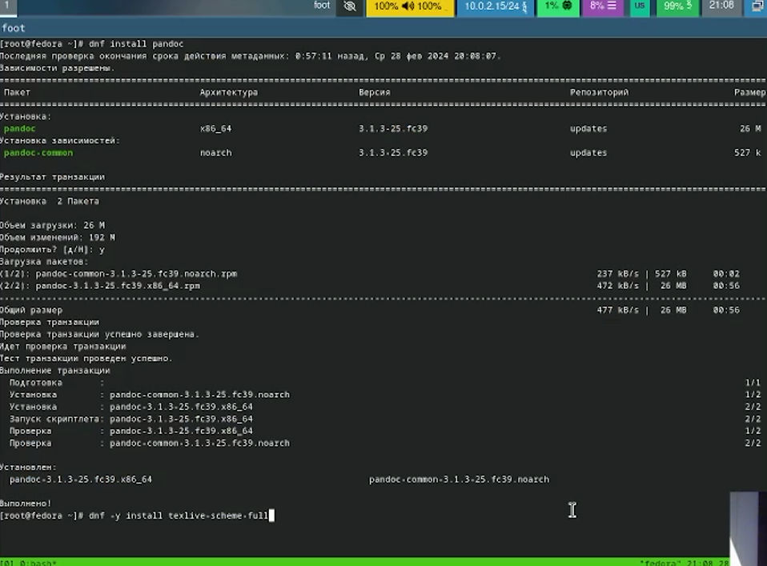

---

# Домашняя работа

Прописываю все комнады и узнаю информацию о системе (dmesg | less и dmesg | grep "инфорацию, которую хочу узнать")
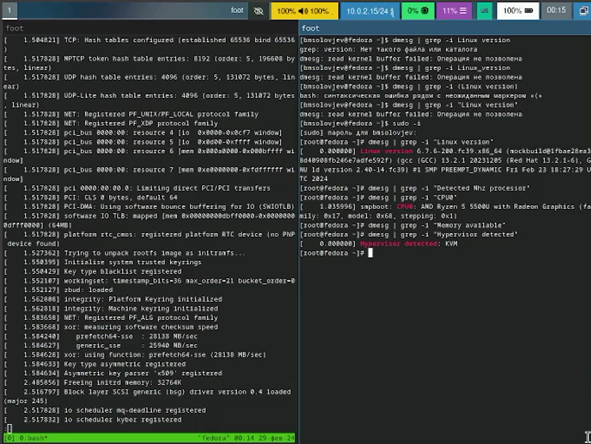

---

# Ответы на вопросы

1 Учетная запись содержит необходимые для идентификации пользователя при подключении к системе данные, а так же информацию для авторизации и учета: системного имени (user name) (оно может содержать только латинские буквы и знак нижнее подчеркивание, еще оно должно быть уникальным), идентификатор пользователя (UID) (уникальный идентификатор пользователя в системе, целое положительное число), идентификатор группы (CID) (группа, к к-рой относится пользователь. Она, как минимум, одна, по умолчанию - одна), полное имя (full name) (Могут быть ФИО), домашний каталог (home directory) (каталог, в к-рый попадает пользователь после входа в систему и в к-ром хранятся его данные), начальная оболочка (login shell) (командная оболочка, к-рая запускается при входе в систему).

---

Для получения справки по команде: <команда> --help; для перемещения по файловой системе - cd; для просмотра содержимого каталога - ls; для определения объёма каталога - du <имя каталога>; для создания / удаления каталогов - mkdir/rmdir; для создания / удаления файлов - touch/rm; для задания определённых прав на файл / каталог - chmod; для просмотра истории команд - history

---

Файловая система - это порядок, определяющий способ организации и хранения и именования данных на различных носителях информации. Примеры: FAT32 представляет собой пространство, разделенное на три части: олна область для служебных структур, форма указателей в виде таблиц и зона для хранения самих файлов. ext3/ext4 - журналируемая файловая система, используемая в основном в ОС с ядром Linux.

---

С помощью команды df, введя ее в терминале. Это утилита, которая показывает список всех файловых систем по именам устройств, сообщает их размер и данные о памяти. Также посмотреть подмонтированные файловые системы можно с помощью утилиты mount.

---

Чтобы удалить зависший процесс, вначале мы должны узнать, какой у него id: используем команду ps. Далее в терминале вводим команду kill < id процесса >. Или можно использовать утилиту killall, что "убьет" все процессы, которые есть в данный момент, для этого не нужно знать id процесса.

---

# Вывод

При выполнении данно лабораторной работы я научился устанавливать ПО и настраивать операционную систему.

---

# Библиография

1. Dash, P. Getting Started with Oracle VM VirtualBox / P. Dash. – Packt Publishing Ltd, 2013. – 86 сс.
2. Colvin, H. VirtualBox: An Ultimate Guide Book on Virtualization with VirtualBox. VirtualBox / H. Colvin. – CreateSpace Independent Publishing Platform, 2015. – 70 сс.
3. Vugt, S. van. Red Hat RHCSA/RHCE 7 cert guide : Red Hat Enterprise Linux 7 (EX200 and EX300) : Certification Guide. Red Hat RHCSA/RHCE 7 cert guide / S. van Vugt. – Pearson IT Certification, 2016. – 1008 сс.
4. Робачевский, А. Операционная система UNIX / А. Робачевский, С. Немнюгин, О. Стесик. – 2-е изд. – Санкт-Петербург : БХВ-Петербург, 2010. – 656 сс.
---
5. Немет, Э. Unix и Linux: руководство системного администратора. Unix и Linux / Э. Немет, Г. Снайдер, Т.Р. Хейн, Б. Уэйли. – 4-е изд. – Вильямс, 2014. – 1312 сс.
6. Колисниченко, Д.Н. Самоучитель системного администратора Linux : Системный администратор / Д.Н. Колисниченко. – Санкт-Петербург : БХВ-Петербург, 2011. – 544 сс.
7. Robbins, A. Bash Pocket Reference / A. Robbins. – O’Reilly Media, 2016. – 156 сс.

